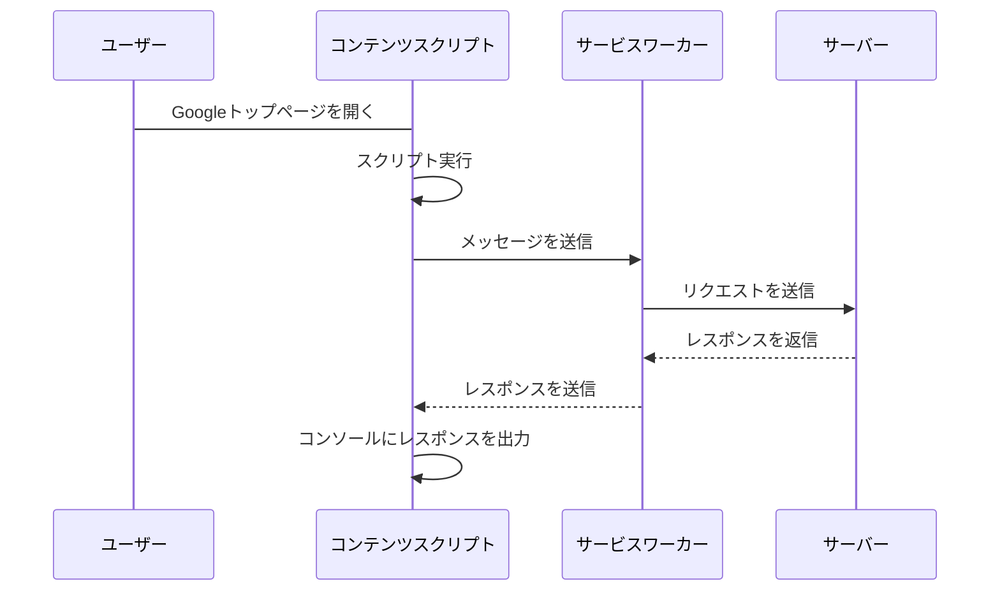

# Chrome 拡張機能デモ

TypeScript + Webpack で Chrome 拡張機能を開発するデモアプリ

## 概要

TypeScript と Webpack を用いて拡張機能を作成しました。
解説記事はこちらです。
TODO: ここにリンクを貼る

#### 今回のデモで実現する動作



## 利用手順

### ビルド手順

```
# ライブラリをインストール
$ npm i
# 開発用ビルド
$ npm run dev
# 本番用ビルド
$ npm run build
```

### ブラウザに読み込む手順

1. chrome://extensions/ で拡張機能ページにアクセスする。
2. 右上のデベロッパーモードをオンにする。
3. 「パッケージ化されていない拡張機能を読み込む」をクリックする。
4. public ディレクトリを開く。
5. My Extension が読み込まれていることを確認する。

### 動作を確認する

#### コンテンツスクリプトの動作を確認する

1. https://www.google.com/?hl=ja にアクセスする
2. 検証ツールを開く(F12)
3. Console タブを開く
4. レスポンスが出力されていることを確認する

#### サービスワーカーの動作を確認する

1. chrome://extensions/ で拡張機能ページにアクセスする。
2. Service Worker をクリックする
3. 2 で検証ツールが表示されるので、Console タブを開く
4. https://www.google.com/?hl=ja にアクセスする
5. レスポンスが出力されていることを確認する

## ディレクトリ構成

```
.
├── public
│   ├── images
│   │   ├── icon-128.png
│   │   ├── icon-16.png
│   │   ├── icon-32.png
│   │   └── icon-48.png
│   ├── background.js
│   ├── content.js
│   └── manifest.json
├── src
│   ├── images
│   │   ├── icon-128.png
│   │   ├── icon-16.png
│   │   ├── icon-32.png
│   │   └── icon-48.png
│   ├── scripts
│   │   ├── background.ts
│   │   └── content.ts
│   └── manifest.json
├── README.md
├── package-lock.json
├── package.json
└── webpack.config.js
```
